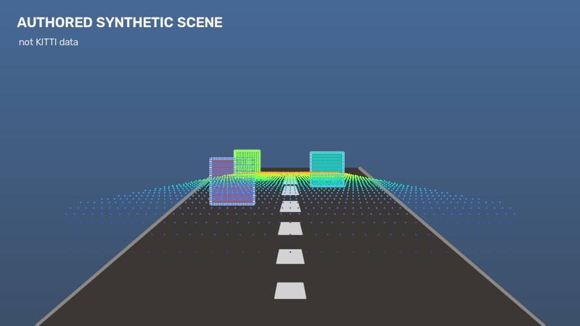
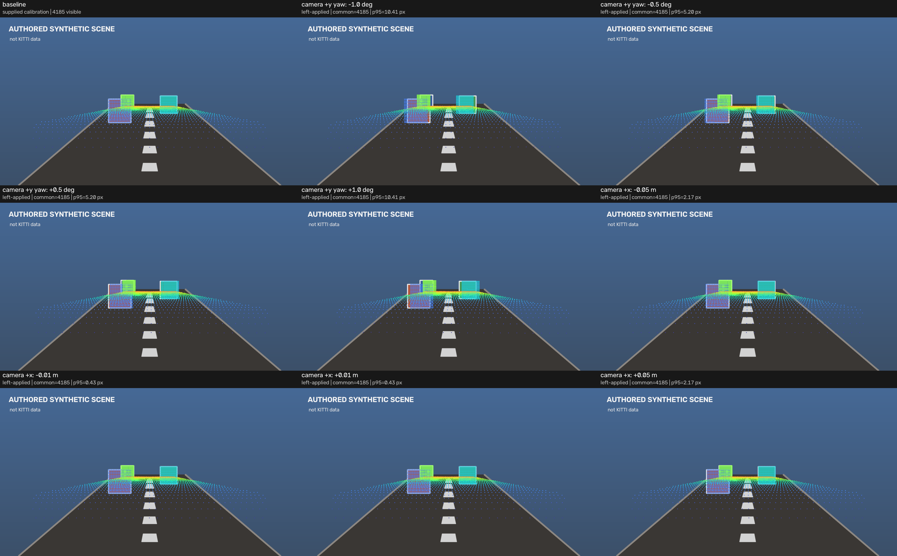

# sensor-fusion-replay-cpp

A C++20-first offline camera/LiDAR replay project for inspectable geometry,
runtime, testing, and performance evidence.

> Status: early `v0.1 Geometry` implementation. This is not a released,
> production, real-time, or safety system.

The product contract is in [`intend.md`](intend.md), the normative architecture
and acceptance gates are in [`spec.md`](spec.md), and ordered work is in
[`plan.md`](plan.md).

## Capability status

| Capability | Status | Evidence |
| --- | --- | --- |
| C++20/CMake quality skeleton | Locally verified | Warnings-as-errors build, format and clang-tidy |
| Frame-labelled SE(3) transforms | Locally verified | Independent unit tests |
| Deterministic frame graph | Locally verified | Forward/inverse/path-invariant tests |
| Rectified 3x4 projection primitive | Locally verified | Hand-computed projection/boundary tests |
| Strict KITTI calibration/data loading | Locally verified on synthetic inputs | Typed parser/I/O negative tests |
| Point-cloud projection and rejection accounting | Locally verified on synthetic inputs | Hand-computed and integration tests |
| Depth-colored z-buffer overlay | Locally verified on synthetic inputs | Deterministic pixel tests |
| Atomic JSON/JSONL run artifacts | Locally verified on synthetic inputs | Schema/accounting/overwrite tests |
| `project_kitti` CLI | Locally verified on synthetic inputs | End-to-end process and exit-code tests |
| Calibration sensitivity | Locally verified on synthetic inputs | Hand-computed sign/axis tests, JSON checks, and inspected nine-panel output |
| Projection microbenchmark | Locally verified on authored synthetic input | Exact per-iteration accounting, CLI/schema tests, and cross-toolchain smoke runs |
| Authored synthetic demo | Locally verified | Staged fixture generator and loader/overwrite/ownership tests |
| Geometric perception | Planned (`v0.2`) | None |
| Replay/backpressure metrics | Planned (`v0.3`) | None |

“Locally verified” currently means 79/79 public tests passed in macOS debug and
a fresh Release build with AppleClang 16 and OpenCV 5.0. The same 79/79 tests
passed with GCC 13, Clang 18, and Clang 18 ASan+UBSan in an Ubuntu 24.04
container built from exact commit `9ef8765`. Format-check passed; the
clang-tidy target completed with no actionable project diagnostics. The README
commands also passed from a separate clean clone. Hosted GitHub Actions has not
run. This state has local commits but has not been pushed, tagged, or released.
Project-authored code and documentation use Apache-2.0.

## Prerequisites

Required tools and libraries are CMake 3.24+, a C++20 compiler, Eigen 3.4+,
OpenCV 4.5+ or 5.x, and nlohmann/json 3.11+. GoogleTest 1.15.2 is fetched at
configure time when a compatible system target is unavailable.

Ubuntu 24.04:

```bash
sudo apt-get update
sudo apt-get install --yes \
  cmake clang-format clang-tidy libeigen3-dev libgtest-dev \
  libopencv-dev nlohmann-json3-dev
```

macOS with Homebrew:

```bash
brew install cmake eigen googletest llvm nlohmann-json opencv
```

## Verified development commands

```bash
cmake --preset dev
cmake --build --preset dev --parallel
ctest --preset dev --output-on-failure
cmake --build --preset dev --target format-check
cmake --build --preset dev --target clang-tidy
```

Create a project-owned KITTI-shaped demo fixture and run both geometry CLIs:

```bash
./build/dev/generate_synthetic_kitti \
  --output-dir artifacts/synthetic_kitti \
  --overwrite
./build/dev/project_kitti \
  --dataset-root artifacts/synthetic_kitti \
  --drive synthetic_drive_sync \
  --frame 0 \
  --output-dir artifacts/synthetic_projection
./build/dev/analyze_calibration \
  --dataset-root artifacts/synthetic_kitti \
  --drive synthetic_drive_sync \
  --frame 0 \
  --output-dir artifacts/synthetic_sensitivity
```

The generated daily root, image, point cloud, calibration, and timestamps are
authored for this repository and contain no KITTI data. Their purpose is a
reproducible public demonstration, not real-data evidence. Maintainers regenerate
the two checked-in README images from a release build with
`./examples/generate_public_artifacts.sh build/release docs/images`.

## Public synthetic geometry evidence



The overlay above is generated from a project-authored road-like image and
project-authored 3D geometry. Color encodes clamped rectified-camera depth; it
is a reproducible pipeline demonstration, not KITTI evidence or calibration
ground truth.



The grid holds the synthetic scene fixed while applying the required camera
`+y` yaw and camera `+x` translation perturbations. Read the
[`frame tree and projection conventions`](docs/frame_conventions.md) before
interpreting the signs or treating `image_02` as an SE(3) frame.

Run the authored projection microbenchmark from an optimized build:

```bash
cmake --preset release
cmake --build --preset release --parallel
./build/release/benchmark_projection \
  --output-json artifacts/benchmarks/projection_benchmark_current.json \
  --overwrite
```

The default run measures 100 iterations of 100,000 deterministic finite points
after 10 warm-up iterations. It times only SE(3) transformation, rectified
projection, classification, and output-vector construction. It does not measure
KITTI decoding, visualization, report serialization, queues, replay pacing, or
end-to-end latency. Formal JSON output is refused for a non-smoke run if the
tree was dirty when CMake configured the build. See
[`docs/benchmark_walkthrough.md`](docs/benchmark_walkthrough.md) for the fixture,
percentile, accounting, and evidence rules.

The retained Apple M4 Pro reference report for clean implementation commit
`185e287` records geometry-only p50/p95/p99 latency of
`0.568/0.648/0.668 ms` and aggregate throughput of
`171.3 million points/s` for this exact authored workload. These are
single-host measurements, not an end-to-end or real-time claim. Inspect the
[`machine-readable report`](docs/results/projection_benchmark_apple_m4_pro.json)
and the incomplete [`v0.1` verification record](docs/v0.1_verification.md)
before quoting them.

Project one frame from an authorized local KITTI Raw synced drive:

```bash
./build/dev/project_kitti \
  --dataset-root /path/to/2011_09_26 \
  --drive 2011_09_26_drive_0005_sync \
  --frame 0 \
  --output-dir artifacts/projection
```

The command creates a unique child run directory containing
`run_summary.json`, `frames.jsonl`, and `overlays/<frame>.png`. Run
`./build/dev/project_kitti --help` for validated defaults and optional flags.
This command shape is tested with authored synthetic inputs. A clean Release
build also consumed frame 0 of an authorized local
`2011_09_26_drive_0005_sync` copy: all 123,397 finite input points were
accounted for, and the private overlay was opened for a visual sanity check.
The KITTI input and derived image remain local and uncommitted.

Run the fixed calibration-sensitivity suite on the same kind of private input:

```bash
./build/dev/analyze_calibration \
  --dataset-root /path/to/2011_09_26 \
  --drive 2011_09_26_drive_0005_sync \
  --frame 0 \
  --output-dir artifacts/sensitivity
```

It writes a baseline, four camera-`+y` yaw panels, four camera-`+x`
translation panels, a combined comparison, and a JSON report. Perturbations are
left-applied in `camera_rect_00`; the report gives common-visible-set median/p95
pixel displacement plus appeared/disappeared counts. Both the public synthetic
comparison and the private frame-0 comparison were opened and inspected. The
private Release run contained one baseline plus all eight required
perturbations; its KITTI-derived images remain local and uncommitted. The
reported `50*tan(1 deg)` value is an analytic illustration, not a measured
calibration error or pixel-accuracy claim.

The `asan-ubsan` preset is intended for the Ubuntu CI toolchain. AppleClang 16's
ASan runtime aborts during test discovery on the current macOS 26.6 host; the
same tests pass under Clang 18 ASan+UBSan in Ubuntu 24.04. This host limitation
must not be presented as a native sanitizer pass.

No KITTI data is distributed by this repository. Obtain authorized data
separately from the [KITTI Raw Data](https://www.cvlibs.net/datasets/kitti/raw_data.php)
page and keep it outside version control.

## License

Project-authored code and documentation are licensed under the
[Apache License 2.0](LICENSE). KITTI data is not included, redistributed, or
relicensed by this project.
