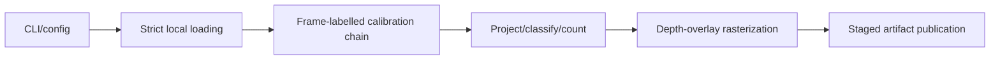
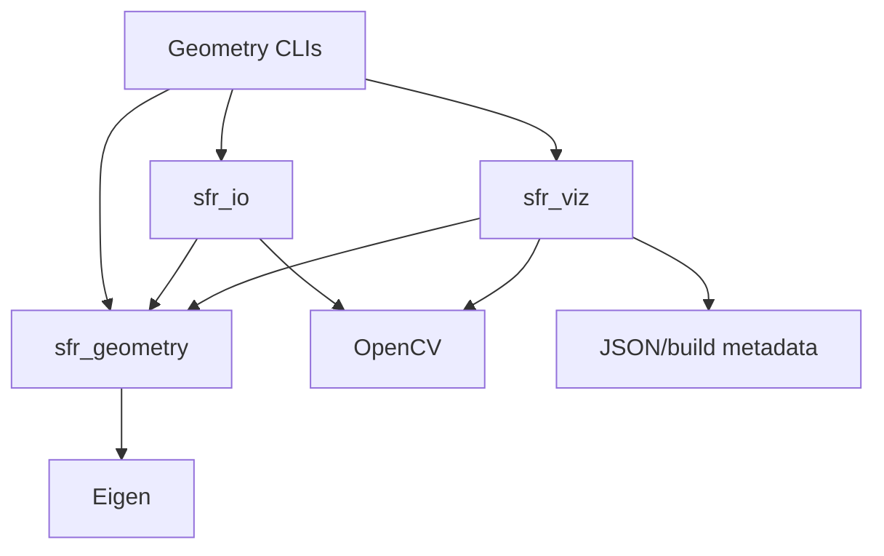

# Architecture

## Implemented scope

Version 0.1 is a synchronous, local, one-frame camera/LiDAR geometry pipeline.
It loads a selected pair, projects LiDAR points, renders a depth overlay, and
publishes machine-readable reports. `analyze_calibration` runs the same geometry
with controlled perturbations. Numeric frame-ID pairing and timestamp-delta
reporting are not nearest-timestamp synchronization.

Perception (`v0.2`) and queues, synchronization, scheduling, and fault injection
(`v0.3`) are planned, not implemented. This is not a state-estimation fusion,
real-time, production, or safety system. Requirements are in
[spec.md](../spec.md); exact-commit verification is in
[reviewability_verification.md](reviewability_verification.md).

## Execution flow



| Stage | Implementation | Output / responsibility |
| --- | --- | --- |
| Composition | [project_kitti.cpp](../apps/project_kitti.cpp), `run` | Validated configuration; load → project → render → publish |
| Input | [kitti_calibration.cpp](../src/io/kitti_calibration.cpp), [kitti_io.cpp](../src/io/kitti_io.cpp) | Strict calibration/layout parsing, selected image/cloud, timestamp metadata |
| Geometry | [point_cloud_projection.cpp](../src/geometry/point_cloud_projection.cpp), `projectPointCloud` | Owned visible-point vector and mutually exclusive rejection counts |
| Visualization | [overlay.cpp](../src/viz/overlay.cpp), `renderDepthOverlay` | Depth-colored BGR overlay and center-pixel z-buffer counts |
| Publication | [projection_artifact.cpp](../src/viz/projection_artifact.cpp) | PNG, `frames.jsonl`, `run_summary.json`; validate counts before publication |

The CLI owns loaded inputs and stage results. Library code does not print or
exit; `main` translates typed errors into diagnostics and exit categories.
No background workers or streaming queues exist in this path.

## Library dependencies

Arrows mean **depends on**, not execution order:



Target definitions: [geometry](../src/geometry/CMakeLists.txt),
[I/O](../src/io/CMakeLists.txt), [visualization](../src/viz/CMakeLists.txt).
Geometry is Eigen-only and cannot depend on codecs, filesystem loading,
visualization, or CLI composition. OpenCV owns image decoding/raster operations;
JSON serialization is not reimplemented. Perception/runtime are not current
library targets.

## Frames and projection

`T_target_source` maps source coordinates into target coordinates. Length/depth
are meters, internal angles are radians, and image positions are continuous
pixels. LiDAR axes are x-forward/y-left/z-up; camera axes are
x-right/y-down/z-forward.

```text
X_raw_00  = T_camera_raw_00_lidar * X_lidar
X_rect_00 = R_rect_00_4x4 * X_raw_00
q         = P_rect_02 * X_rect_00
u = q.x / q.z; v = q.y / q.z
```

`KittiCalibration::TCameraRect00Lidar()` composes
`T_camera_rect_00_camera_raw_00` (rectification rotation, zero translation) with
`T_camera_raw_00_lidar`. Projection retains the full `3x4 P_rect_02`, including
its fourth column; replacing it with the left `3x3` changes the geometry.
`image_02` is a projection domain, not an SE(3) frame. See the separate
[frame tree](frame_conventions.md#frame-tree); world/vehicle edges are unresolved.

## Ownership and allocation

`projectPointCloud(span, T_camera_rect_00_lidar, projection)` borrows a contiguous
read-only cloud only for the call and retains no input references. Its return
value owns the visible points and counters. Runtime frame labels reject
incompatible endpoints; they are not compile-time tags or physical mounting
validation.

The loop is O(N) with O(N) reserved output storage, reserving up to N visible
points to avoid repeated vector growth. There is no intermediate transformed
cloud allocation, but this is not zero-allocation processing. Visible points
preserve input-span index/order and reflectance. The loader first compacts finite
records, so a source index is not the original binary-record ID after filtering.

Expected per-point rejection is a status, not a run-level exception. Immutable
`ProjectionResult` construction rejects unknown statuses or status/payload
disagreement. No default pixel/depth payload is substituted for missing data.

## Invariants and tests

Tests below define synthetic contracts; consult the verification record for
passing runs. Expected geometry values are derived independently of production
functions.

| Invariant | Enforcement | Regression / numeric test |
| --- | --- | --- |
| Composition endpoints match | `compose` | `RejectsFrameMismatchDuringComposition` in [rigid_transform_test.cpp](../tests/unit/rigid_transform_test.cpp) |
| Full projection matrix retained | `RectifiedProjection::project` | `PreservesFullThreeByFourProjectionMatrix` in [projection_test.cpp](../tests/unit/projection_test.cpp) |
| Visible status iff payload exists | `ProjectionResult` constructor | `RejectsVisibleResultWithoutPayload`, `RejectsRejectionResultWithPayload`, `RejectsUnknownResultStatus` in [projection_test.cpp](../tests/unit/projection_test.cpp) |
| Every geometry input has one terminal bucket | Loop branches; artifact `validateRequest`; benchmark `validateCounts` | `AccountsForEveryInputAndPreservesSourceIndex` in [point_cloud_projection_test.cpp](../tests/unit/point_cloud_projection_test.cpp); `RejectsUnsafeRunIdAndBrokenAccounting` in [projection_artifact_test.cpp](../tests/unit/projection_artifact_test.cpp) |
| Nearest depth wins at projected center pixel | Strict depth comparison in `renderDepthOverlay` | `UsesNearestDepthAndClampsRoundedUpperBoundary` in [overlay_test.cpp](../tests/unit/overlay_test.cpp) |
| Cleanup owns only claimed staging directory | Successful `create_directory` before RAII ownership | `PreservesPreexistingTemporaryDirectory` in [projection_artifact_test.cpp](../tests/unit/projection_artifact_test.cpp) |

The main projection fixture maps `(1,1,2)` through identity and an authored matrix
to `u=2*1/2+4=5`, `v=2*1/2+3=4`, depth `2 m`. Four records produce one visible,
one near-depth, one outside-image, and one non-finite result.

Loader accounting (finite plus non-finite equals file records) is separate from
projection accounting over the input span. The z-buffer equation is
`visible = winning_center_pixels + occluded_points`. Equal-depth centers keep
the first point. `rendered_pixels` counts winning centers, not colored circle
footprints; radius > 0 footprints can overlap in raster draw order. The overlay
is not a surface-accurate renderer or calibration ground truth.

## Failure and publication contracts

Duplicate `P_rect_02` → `parseRequiredFields` throws `IoError` → loading stops →
`main` emits an input diagnostic and returns 3 → no final artifact is published.
There is no retry or corrupt-input skipping. See `RejectsDuplicateRequiredKey`
in [calibration_test.cpp](../tests/unit/calibration_test.cpp) and
`RejectsDuplicateCalibrationWithoutPublishingOutput` in
[project_kitti_cli_test.cpp](../tests/integration/project_kitti_cli_test.cpp).
Other exit categories are configuration (2), processing/invariant (4), and
output (5); an invisible point is not a CLI failure.

For a new run, all output files close in an exclusively claimed temporary
sibling before the directory is renamed into view. Failed staging is cleaned by
RAII. No fsync/crash durability is implemented. Explicit overwrite removes the
old directory before rename: replacement is not gap-free or transactional and
a publication failure can lose the old run. Prefer unique run IDs.

## Timing and evidence boundaries

- One-frame reports contain one sample, so p50=p95=p99 is not tail-latency
  evidence. `processing_total` sums measured stages, not end-to-end sojourn.
- Projection serialization covers overlay PNG encode/write. Sensitivity also
  covers panel/grid work and its sensitivity report. Final JSONL/summary writing,
  output preparation and directory publication are excluded. Summaries expose
  `measurement` and `publication`; see [spec §10.2](../spec.md#102-run_summaryjson).
- Fixed input order gives deterministic geometry decisions. Run IDs, timings,
  build/host metadata vary; whole JSON artifacts are not byte-identical.
- The [projection benchmark](benchmark_walkthrough.md) measures synthetic
  transform/project/classify/output-vector construction, not I/O, rendering,
  synchronization, publication, or end-to-end FPS. It records provenance and
  validates all warm-up/measured iterations. Historical numbers do not measure
  later source revisions.
- Sensitivity measures change relative to supplied calibration, not calibration
  accuracy. Private KITTI observations do not generalize to all scenes.

## Reproduce with authored synthetic input

From repository root, after installing [dependencies](../README.md#prerequisites):

```bash
cmake --preset dev
cmake --build --preset dev --parallel
ctest --preset dev --output-on-failure
ctest --preset dev -R 'PointCloudProjectionTest|ProjectionTest|CalibrationTest|ProjectKittiCliTest' --output-on-failure
./build/dev/generate_synthetic_kitti --output-dir artifacts/architecture_fixture
./build/dev/project_kitti --dataset-root artifacts/architecture_fixture --drive synthetic_drive_sync --frame 0 --output-dir artifacts/architecture_projection
./build/dev/analyze_calibration --dataset-root artifacts/architecture_fixture --drive synthetic_drive_sync --frame 0 --output-dir artifacts/architecture_sensitivity
```

The generator refuses an existing fixture; use a new directory for a rerun or
explicitly request `--overwrite`. Both CLIs print their unique run directories.
Inspect overlay/comparison images, `run_summary.json`, and `frames.jsonl`;
verify counts and `build.git_commit/git_dirty`, not only success status.
Generated fixture and output stay local and ignored; KITTI is not required.
