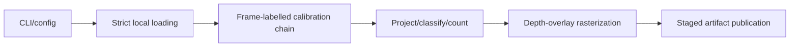
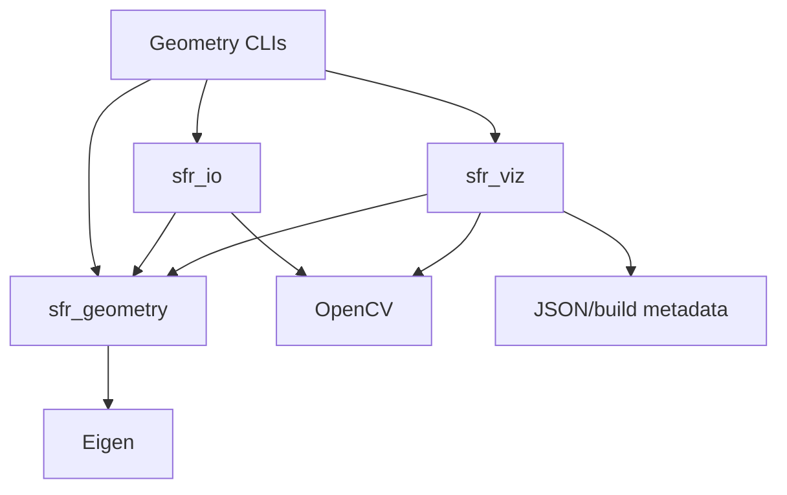

# Code Review and Technical Walkthrough

This is a reading route for the implemented `v0.1` geometry path, not another
specification. Requirements live in [spec.md](../spec.md); historical release
results live in [v0.1_verification.md](v0.1_verification.md). Read the commit/date
on any verification record before quoting it. A defined test is not a passing run.

## 60-second opener / 開場

This C++20 project projects local camera/LiDAR data offline. The CLI validates
configuration, strictly loads calibration and a selected image/cloud pair,
transforms LiDAR points into `camera_rect_00`, applies the full `3x4 P_rect_02`,
and classifies every geometry input point. It renders a depth-colored overlay
and publishes reports from a claimed staging directory. Its key contracts are
frame-compatible transforms and explicit point accounting, backed by independent
numeric fixtures. Version 0.1 has no timestamp synchronizer, queues, perception,
tracking, state-estimation fusion, or real-time/safety guarantee.

繁中提示：先講本機輸入、座標轉換、完整投影、分類與輸出。接著說清楚
「frame 語意不能靠矩陣可相乘來保證」，最後分開已實作與未做的能力。
不要從 dependencies 或逐行翻譯 C++ 開始。

## Two maps: execution versus dependencies

Execution of `project_kitti` (six blocks):



This is synchronous one-frame composition, not threaded replay. Matching numeric
frame IDs and reporting timestamp delta does not implement nearest-time matching.

Build dependencies (arrows mean "depends on"):



See [src/geometry/CMakeLists.txt](../src/geometry/CMakeLists.txt),
[src/io/CMakeLists.txt](../src/io/CMakeLists.txt), and
[src/viz/CMakeLists.txt](../src/viz/CMakeLists.txt). Perception/runtime are not
implemented targets. Frame geometry is a separate map in
[frame_conventions.md](frame_conventions.md); world/vehicle edges are unresolved.

## Fixed route: three stations, optional drill-downs

Use symbol names to navigate; line numbers drift as code changes. Prepare these
files before discussion rather than searching the repository while explaining.

| Station | Open / symbol | Explain before moving on |
| --- | --- | --- |
| Entry | [apps/project_kitti.cpp](../apps/project_kitti.cpp), `run`, then `main` | Load → project → render → publish; local ownership, timing boundaries, exit categories |
| Invariant | [src/geometry/point_cloud_projection.cpp](../src/geometry/point_cloud_projection.cpp), `projectPointCloud` | Input contract, frame check, mutually exclusive statuses, source index, output allocation |
| Proof | [tests/unit/point_cloud_projection_test.cpp](../tests/unit/point_cloud_projection_test.cpp), `AccountsForEveryInputAndPreservesSourceIndex` | Independent arithmetic and expected buckets; what this fixture does not prove |

Only open another file when the question needs it:

- Frame composition: [rigid_transform.hpp](../include/sfr/geometry/rigid_transform.hpp),
  [compose implementation](../src/geometry/rigid_transform.cpp), and
  `RejectsFrameMismatchDuringComposition` in
  [rigid_transform_test.cpp](../tests/unit/rigid_transform_test.cpp).
- Full projection matrix: [projection.cpp](../src/geometry/projection.cpp) and
  `PreservesFullThreeByFourProjectionMatrix` in
  [projection_test.cpp](../tests/unit/projection_test.cpp).
- Failure/publication: [kitti_calibration.cpp](../src/io/kitti_calibration.cpp),
  [projection_artifact.cpp](../src/viz/projection_artifact.cpp), and their tests.
- Rendering: [overlay.cpp](../src/viz/overlay.cpp); it is downstream of geometry.
- Sensitivity: [calibration_sensitivity.cpp](../src/geometry/calibration_sensitivity.cpp)
  and [analyze_calibration.cpp](../apps/analyze_calibration.cpp).
- Performance: [benchmark_walkthrough.md](benchmark_walkthrough.md),
  [benchmark source](../benchmarks/benchmark_projection.cpp), then the
  [historical JSON](results/projection_benchmark_apple_m4_pro.json).

## 15-minute route / 時間切法

| Time | Topic | Required answer |
| --- | --- | --- |
| 0–1 min | Scope | User, local inputs, outputs, explicit non-goals |
| 1–2 min | Flow | Walk the six execution blocks; distinguish dependency/frame maps |
| 2–5 min | Entry | Explain `run()`; skip argument helpers unless asked |
| 5–8 min | Invariant | Signature → ownership → branches → failure → complexity |
| 8–10 min | Failure | Duplicate calibration key → typed error → exit 3; no retry |
| 10–12 min | Proof | Hand-computed test plus one machine-readable artifact |
| 12–14 min | Limits | Runtime frame checking, allocation, measurement/publication limits |
| 14–15 min | Drill-down | Ask whether to inspect geometry, I/O, artifacts, or performance |

Five-minute version: scope 30 s, flow 60 s, entry/invariant 120 s,
proof/limits 90 s. If interrupted, return to the contract and the prepared symbol;
do not guess implementation details.

## Explain the core function, not its syntax

`projectPointCloud(span, T_camera_rect_00_lidar, projection)` borrows a contiguous
read-only cloud for the call; it retains no input references. The return value
owns visible points and counters. Coordinates/depth are meters, image positions
are continuous pixels. The transform must map `lidar` into `camera_rect_00`.

1. Reject wrong frame endpoints as a typed contract error before processing.
2. Reserve output capacity for up to N points: O(N) time and O(N) reserved storage,
   with no intermediate transformed-cloud allocation. This spends memory to
   avoid repeated output-vector growth; it is not a zero-allocation claim.
3. Reject non-finite records, transform finite coordinates, then classify.
   Expected per-point rejection is a result, not an exception.
4. Preserve input-span index/order, reflectance, and camera-forward depth for
   visible points. CLI loading first compacts finite records, so this index is
   not an original `.bin` record ID after filtering.
5. Explain where the accounting equation is checked: artifact validation and
   benchmark validation, not a separate final assertion in the geometry loop.

The exact chain is `T_camera_rect_00_lidar = compose(R_rect_00,
T_camera_raw_00_lidar)`, followed by full `P_rect_02 * [X_rect_00, 1]`.
The fourth matrix column matters; `image_02` is not an SE(3) frame.

## Invariant → counterexample → enforcement → proof

| Must hold | Bad case | Enforcement | Independent test |
| --- | --- | --- | --- |
| Composition endpoints match | Numerically multiply unrelated frames | `compose` in rigid_transform.cpp | `RejectsFrameMismatchDuringComposition` |
| Full `3x4 P` is used | Drop the camera-baseline column | `RectifiedProjection::project` | `PreservesFullThreeByFourProjectionMatrix` |
| Visible status has a point; rejection does not | Substitute a fake `(0,0,0)` point | Validating, immutable `ProjectionResult` | `RejectsVisibleResultWithoutPayload`, `RejectsRejectionResultWithPayload`, `RejectsUnknownResultStatus` in projection_test.cpp |
| Every geometry input gets one bucket | Silent skip or double counting | Loop branches; artifact `validateRequest`; benchmark `validateCounts` | `AccountsForEveryInputAndPreservesSourceIndex`; `RejectsUnsafeRunIdAndBrokenAccounting` |
| Nearest depth wins at each projected center pixel | Far point hides near point | Strict `<` in `renderDepthOverlay` | `UsesNearestDepthAndClampsRoundedUpperBoundary` in [overlay_test.cpp](../tests/unit/overlay_test.cpp) |
| Staging cleanup owns its directory | Delete another writer's preexisting temporary directory | Successful `create_directory` before RAII ownership | `PreservesPreexistingTemporaryDirectory` in [projection_artifact_test.cpp](../tests/unit/projection_artifact_test.cpp) |

Finite loader records plus loader non-finite records equal original file records.
Projection accounting is a separate equation over the geometry input. The
z-buffer equation is `visible = winning_center_pixels + occluded_points`;
`rendered_pixels` counts winning centers, not every colored pixel in drawn circles.
Equal-depth centers keep the first input point. Radius > 0 circle footprints can
overlap later in raster draw order; this is not a surface-accurate renderer.

繁中句型：「X 必須成立；否則 Y；Z 拒絕／檢查；W 測試固定此行為。」

## One complete failure path

Duplicate `P_rect_02` in calibration:

1. `parseRequiredFields` rejects the duplicate with `IoError`.
2. `loadKittiCalibration` propagates the input error; `run` stops before projection.
3. `main` catches it, writes an input diagnostic to stderr, returns exit code 3.
4. No final artifact is published; no automatic retry or corrupt-input skipping.

Inspect `RejectsDuplicateRequiredKey` in
[calibration_test.cpp](../tests/unit/calibration_test.cpp) and the CLI tests in
[project_kitti_cli_test.cpp](../tests/integration/project_kitti_cli_test.cpp).
For other paths, distinguish configuration (2), input (3), processing (4), and
output (5); an ordinary invisible point is none of these run failures.

Publication has a narrower guarantee: all files close in an exclusively claimed
temporary sibling before a new final directory is renamed into view. Failed
staging is cleaned by RAII. No fsync/crash-durability guarantee is implemented.
Explicit overwrite removes the old directory before rename: it is not a gap-free
transactional replacement, and publication failure can lose the old run.

## Reproduce proof without KITTI

Run from repository root after installing the documented [dependencies](../README.md#prerequisites):

```bash
cmake --preset dev
cmake --build --preset dev --parallel
ctest --preset dev --output-on-failure
ctest --preset dev -R 'PointCloudProjectionTest|ProjectionTest|CalibrationTest|ProjectKittiCliTest' --output-on-failure
./build/dev/generate_synthetic_kitti --output-dir artifacts/walkthrough_fixture
./build/dev/project_kitti --dataset-root artifacts/walkthrough_fixture --drive synthetic_drive_sync --frame 0 --output-dir artifacts/walkthrough_projection
./build/dev/analyze_calibration --dataset-root artifacts/walkthrough_fixture --drive synthetic_drive_sync --frame 0 --output-dir artifacts/walkthrough_sensitivity
```

Generator refuses an existing fixture; on a rerun use a new output directory or
deliberately request `--overwrite`. Projection/sensitivity print their unique
run-directory paths. Open that run's overlay/comparison, `run_summary.json`, and
`frames.jsonl`. Verify counts and `build.git_commit/git_dirty`, not just success
status. Local output is ignored; do not commit the generated fixture.

In the main numeric test, `(1,1,2)` with identity transform and authored matrix
gives `u=2*1/2+4=5`, `v=2*1/2+3=4`, camera depth `2 m`. Four input records give
one visible, one near-depth rejection, one outside, one non-finite. Expected
values are literals derived independently, not production-generated oracles.

The full `3x4` test separately derives `(2*1+1)/4=0.75` and
`(4*2+2)/4=2.5`; replacing P with just its left `3x3` would fail it.

## Evidence and honest limitations

- Source → defined test → historical run → fresh exact-commit run → attributed
  artifact are different claims. Production/SLO evidence does not exist here.
- The retained Release benchmark belongs to `185e287`, Apple M4 Pro. Read its
  configuration, 10 warm-ups, 100 measured iterations, 100,000 points/sample,
  nearest-rank method, checked counts, and exclusions before quoting latency.
  It measures transform/project/classify/output-vector construction, not I/O,
  visualization, publication, timestamp matching, or end-to-end FPS.
- A one-frame CLI report has one latency sample; p50=p95=p99 is not a tail-latency
  study. Its stage sum is not the `v0.3` runtime processing/sojourn metric.
- Fixed input ordering gives deterministic geometry decisions. Run IDs, timings,
  build/host metadata vary; whole JSON artifacts are not byte-identical.
- Visual overlays are sanity checks, not calibration ground truth. Sensitivity
  measures changes relative to supplied calibration, not calibration accuracy.
- Runtime FrameId supports loaded frame names but catches errors at runtime,
  not compile time. Geometry checks frame labels, not whether the sensor was
  physically mounted/calibrated correctly.
- Future production work would require synchronization, bounded queues,
  cancellation/shutdown, calibration versioning, sensor health, and full timing.
  Those are not implemented `v0.1` capabilities or sufficient safety validation.

## Reviewer prompts and rehearsal gate

Ask: Why full P? Why runtime FrameId? Why span/owned vector? Why reserve N?
Where is accounting checked? Which failures throw versus return status? What
happens on output failure? What exactly does the benchmark include? What would
break if calibration convention changed? Which test would catch that?

A prepared engineer should explain scope/flow in 2 min, find entry/core in 5 min,
trace one invariant to its test without global search, walk one failure path,
and state evidence limits by 15 min. Static links and executable commands alone
do not prove another engineer can meet this gate: a human timed rehearsal is
required and must be recorded separately, not invented.

AI assistance: artifacts prove decisions, code, and verification, not who typed
each line. Do not invent a percentage or personal defect story. Explain only
the design decisions and review examples you can personally defend.
